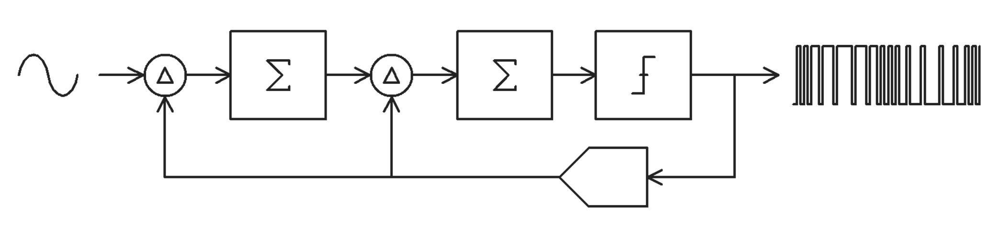

# Overview
This is the EE372 VLSI Design Project at Stanford University. The chip is an incremental Delta-Sigma ADC in Skywater 130 nm CMOS technology.


Delta-Sigma Modulator Functional Diagram


# Specifications
| Specification | Value        |
| ------------- | ------------- |
| ENOB | 12 bits |
| SQNR | 74 dB |
| Conversion Rate | 10 KSPS |
| OSR | 512 |
| Sampling Rate | 5.12 MHz |
| VDD | 1.8 V |
| Input Range | 90% FS |
| Input CM | VDD/2 |

# Setup and Run Tests
Make sure the Skywater SKY130 PDK is installed on the Farmshare servers under `/farmshare/home/classes/ee/372/PDKs/` and update the various paths in the `setup.csh` file.


For schematic tests, run
```
source setup.csh
```
Next, enter the schematic testbench directory
```
cd ./verification/schematic
```
Open a test using XSCHEM by running
```
xschem <testbench_name>.sch
```
Generate a netlist, run NGSPICE simulation, and view the waveforms by clicking the buttons on the top-right corner of the XSCHEM GUI.

---

For RTL tests, run
```
make
```
to run all tests, or run
```
make <number>
```
to run individual tests, where `<number>` is the number corresponding to the test in the Makefile.


# Contact
- Raymond Yang (rhyang@stanford.edu)
- Yaqing Xia (yaqingx@stanford.edu)

